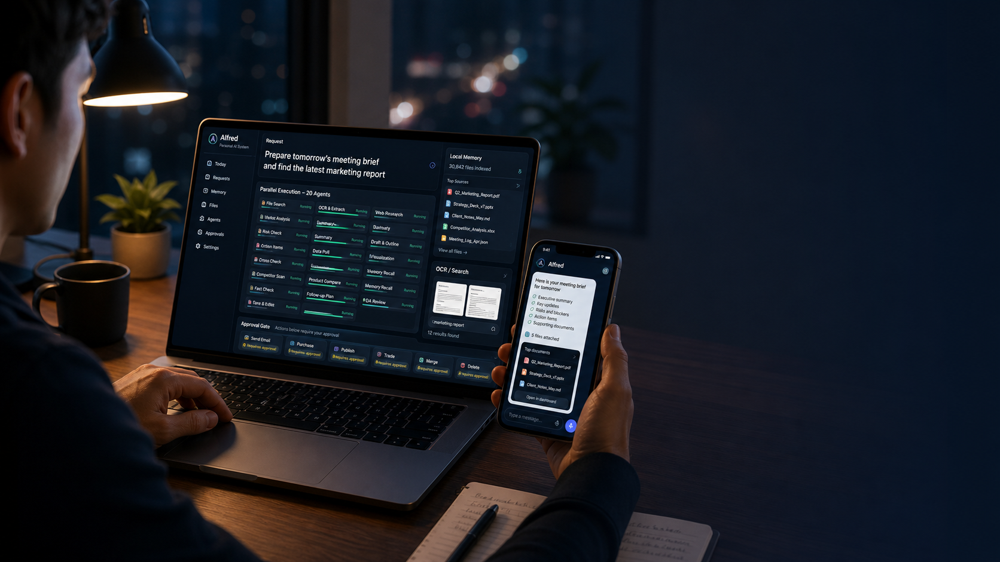

# Alfred System

**One request becomes twenty specialist workers. The work is already prepared by the time you ask.**

> Background cognition instead of foreground token burn.

<p align="center">
  <a href="https://charenix.com/alfred/demo"><strong>Live Demo</strong></a>
  ·
  <a href="web/alfred-morning-brief-demo.html"><strong>Demo Source</strong></a>
  ·
  <a href="assets/alfred-system-architecture.svg"><strong>Architecture Diagram</strong></a>
  ·
  <a href="docs/ARCHITECTURE.md"><strong>Architecture Docs</strong></a>
  ·
  <a href="docs/X_LAUNCH_POSTS.md"><strong>X Launch Posts</strong></a>
  ·
  <a href="docs/SYSTEM_HANDOFF.md"><strong>System Handoff</strong></a>
</p>

<p align="center">
  <a href="https://charenix.com/alfred/demo">
    
  </a>
</p>

<p align="center">
  <a href="assets/alfred-system-architecture.svg"><strong>View the system architecture diagram</strong></a>
</p>

Alfred is a personal AI Agent system that prepares your work memory in the
background, then uses local models, file maps, and concurrent workers to find
files, read images, summarize documents, prepare meetings, and finish complex
tasks faster and safer across the interfaces you already use.

This repository is the clean open-source reference architecture for the Alfred
system. It does not include private user data, production secrets, LINE tokens,
Google OAuth tokens, private databases, or proprietary deployment files.

## What Alfred Does

Alfred turns one request into a coordinated team of specialist workers.

Instead of asking one chatbot to improvise an answer, Alfred prepares the user's
work world in the background:

- indexes files
- extracts text and images
- builds summaries
- links meetings, calendar, messages, and documents
- remembers preferences and unresolved commitments
- routes requests through Afu Brain
- runs parallel specialist workers when a task is complex
- prepares real actions while blocking risky final submission

The user experience should feel simple:

```text
Ask once.
Alfred already knows where to look.
Twenty Afu workers prepare the answer in parallel.
The result arrives as usable work, not raw chat.
Risky actions wait for approval.
```

## Why It Matters

Most personal AI tools are still foreground chat interfaces. They wait for a
question, gather context slowly, spend tokens, and often return a polished but
unverified answer.

Alfred is designed around a different promise:

```text
The system works before the user asks.
```

That changes the economics and the feeling of the product.

| User Pain | Alfred Approach | Result |
|---|---|---|
| "I know I have this file somewhere." | Prepared file map, OCR, summaries, and local search | Faster retrieval with less model cost |
| "I need to prepare for a meeting." | Parallel workers gather files, risks, questions, and draft follow-up | Meeting pack instead of generic advice |
| "I want to compare products or investments." | Evidence, dissent, pricing, risk, and action lanes run together | Better decision prep without blind execution |
| "I want automation, but I do not trust it." | MASL / Brain Gate blocks send, pay, trade, publish, merge, delete | Useful autonomy without reckless autonomy |
| "LLM calls are too expensive for everything." | Background computation, SQLite, deterministic rules, local models, cached summaries | Lower foreground token burn |

## Product Benefits

Alfred is built to improve four things at once:

### Speed

Prepared memory means Alfred can answer from indexed local context instead of
starting a large search after the user asks. The target product feeling is:

```text
I ask for a file, and it appears immediately.
```

### Cost

The expensive work is not always an LLM call. Alfred can use:

- local SQLite indexes
- extracted text
- cached summaries
- deterministic filters
- local models
- selective cloud model calls only when needed

### Quality

Parallel workers create independent lanes:

- evidence
- risk
- dissent
- memory
- file search
- action draft
- synthesis

This makes the result less likely to become one confident, unchecked answer.

### Safety

Alfred can prepare real work, but it should not silently cross dangerous final
action boundaries. Sending, paying, trading, publishing, merging, deleting, and
transferring require approval.

## What The Demo Shows

The browser demo is a product narrative for Alfred's core loop:

1. A user asks for something concrete.
2. Alfred turns it into a work plan.
3. Afu workers prepare context in parallel.
4. Alfred returns a usable brief.
5. The approval gate blocks risky final actions.

Live demo:

```text
https://charenix.com/alfred/demo
```

The demo includes scenarios for:

- meeting preparation
- shopping comparison
- investment research
- document retrieval
- daily operations

It uses a server-side TTS proxy in production, so no ElevenLabs key is exposed in
the browser.

## High-Level Architecture

```text
User request
  ↓
Alfred interface
  voice / Safari / Telegram / email / app
  ↓
Afu Brain
  intent, memory need, risk, route, approval boundary
  ↓
Afu Skill Runtime
  file map, OCR, summaries, calendar, message context, local search
  ↓
Parallel Claw
  background workers and foreground specialist lanes
  ↓
MASL / Brain Gate
  allow, prepare, ask, block
  ↓
User receives prepared work
  ↓
Feedback updates memory and future routing
```

## Core Capabilities

### Prepared File Memory

Alfred can build a local memory layer from files before the user asks:

- materialization
- extraction
- OCR
- summarization
- classification
- linking
- search

### Parallel Worker Execution

Parallel Claw represents the execution model:

- many small workers run at once
- each worker owns one lane of the problem
- the system synthesizes the result into one answer
- final actions go through an approval gate

### Afu Brain Routing

Afu Brain is the routing and decision layer. It decides:

- what the user is asking for
- which memory or tool should be used
- whether the request is low-risk or high-risk
- whether the answer can be returned directly
- whether an action must be blocked or approval-gated

### Approval-Gated Action Prep

Alfred is useful because it can prepare real work:

- draft an email
- prepare a cart
- prepare an order plan
- prepare a meeting brief
- prepare a file response
- prepare calendar changes

But the final action is gated.

That is the difference between helpful automation and unsafe automation.

## The Core Idea

Most AI agents wait until the user asks, then send large context to an expensive
model.

Alfred uses a different cost curve:

```text
before the user asks:
  background workers index, extract, summarize, cluster, and link context

when the user asks:
  retrieve prepared local memory
  use a small local model or cloud model only if needed
  return the result quickly
```

The result is an AI system that can feel as useful as a large LLM while using
far cheaper background computation.

## Demo Claims This Architecture Is Built Around

These are the concrete product moments the architecture is designed to support:

```text
1 second:
  Ask in Telegram, search 30,000 prepared files, return the correct file.

14.3 seconds:
  Upload a dense exam sheet image, extract questions and answers, reply.

20 concurrent workers:
  Indexers, extractors, summarizers, meeting-prep workers, risk scanners,
  relationship mappers, and synthesis workers prepare context before the user asks.
```

## System Parts

| Part | Role |
|---|---|
| Alfred | User-facing personal AI Agent system across voice, Safari, Telegram, email, and future channels |
| Afu Skill Runtime | High-performance office/local runtime: file-map, local model, Drive, Calendar, meetings, OCR, tracing |
| Afu Brain | Memory, cognition, routing, safety, and learning layer |
| Parallel Claw | Concurrent background workers and foreground specialist-agent execution |
| MASL / Brain Gate | Final action gate: allow, prepare, ask, or block |

Correct relationship:

```text
Alfred receives the request.
Afu Brain decides memory, route, risk, and approval boundary.
Afu Skill Runtime supplies prepared local work memory.
Parallel Claw runs background workers or foreground specialist lanes.
MASL / Brain Gate stops risky final actions.
Feedback updates Afu Brain.
```

## What Is In This Release

This repository includes:

- architecture docs
- public schemas
- a local SQLite file-memory reference implementation
- Afu Brain style routing and decision contracts
- Parallel Claw style worker contracts
- a small runnable demo
- safety and privacy rules for open-source releases

It intentionally does not include:

- production Alfred backend source
- private Afu deployment files
- private Google/LINE/Telegram credentials
- private user files or DBs
- internal logs
- user identity mappings

## Quick Start

```bash
python3 -m venv .venv
source .venv/bin/activate
pip install -e .

alfred-system-demo
```

Or run directly:

```bash
python3 examples/demo.py
```

The demo creates a temporary file-memory index, runs background workers, asks a
file-search request, routes it through Afu Brain, and returns a prepared result.

## Browser Demo

Live demo:

```text
https://charenix.com/alfred/demo
```

Local static demo:

```bash
python3 -m http.server 18790
open http://127.0.0.1:18790/web/alfred-morning-brief-demo.html
```

The public demo uses a server-side TTS proxy. Do not put ElevenLabs or other API
keys in the browser. For local narration, copy:

```bash
cp web/local-tts-config.example.js web/local-tts-config.js
```

Then add local credentials to `web/local-tts-config.js`. That file is ignored by
git and must never be committed.

## Why This Is Not Just RAG

RAG usually means "retrieve when asked."

Alfred's file memory is prepared before the question:

```text
materialize -> extract -> summarize -> classify -> link -> cache -> search
```

The search path should be fast because the expensive work happened ahead of
time. A local model can be used for reranking or synthesis, but the system should
not default to sending the entire private file world to a cloud model.

## Why This Is Not 20 Expensive LLM Calls

Parallel Claw has two modes.

### Background Worker Mode

Runs continuously or on schedule:

- file indexer
- text extractor
- summary backfill
- calendar linker
- meeting prep worker
- risk scanner
- duplicate/stale detector
- relationship mapper
- search optimizer
- daily brief writer

Many of these workers use cheap tools:

- SQLite
- metadata
- full-text search
- deterministic rules
- local embeddings
- cached summaries
- local models

### Foreground Specialist Mode

Runs when a complex task needs parallel analysis:

- research lane
- evidence lane
- risk lane
- dissent lane
- memory lane
- execution draft lane
- synthesis lane

Foreground mode is useful, but the bigger breakthrough is background cognition.

## Final Action Safety

Alfred can prepare real work, but must not silently cross dangerous final action
boundaries.

Blocked or approval-gated actions include:

- send
- pay
- publish
- submit
- merge
- delete
- trade
- transfer

Every run should end as:

```text
completed
needs_approval
blocked
failed_with_trace
```

## Repository Layout

```text
src/alfred_system/
  brain.py          Afu Brain style routing and decision logic
  file_memory.py    SQLite file-map and prepared-memory reference
  workers.py        background worker contracts
  parallel_claw.py  foreground/background execution contracts
  schemas.py        dataclasses shared by the reference runtime
  cli.py            demo CLI

schemas/
  alfred_event.schema.json
  brain_decision.schema.json
  worker_result.schema.json
  parallel_run.schema.json

docs/
  ARCHITECTURE.md
  AFU_SKILL_RUNTIME.md
  AFU_BRAIN.md
  PARALLEL_CLAW.md
  PRODUCT_STORY.md
  OPEN_SOURCE_BOUNDARY.md
  SECURITY_AND_PRIVACY.md
  VOICE_TTS_HANDOFF.md
  RELEASE_CHECKLIST.md
  SYSTEM_HANDOFF.md
```

## Recommended Reading Order

1. `docs/PRODUCT_STORY.md`
2. `docs/ARCHITECTURE.md`
3. `docs/AFU_SKILL_RUNTIME.md`
4. `docs/AFU_BRAIN.md`
5. `docs/PARALLEL_CLAW.md`
6. `docs/SECURITY_AND_PRIVACY.md`
7. `docs/OPEN_SOURCE_BOUNDARY.md`
8. `docs/VOICE_TTS_HANDOFF.md`
9. `docs/RELEASE_CHECKLIST.md`

## Product Sentence

```text
Alfred works before you ask.
```

Commercial version:

```text
Alfred turns your files, calendar, meetings, and messages into instant private
work memory, then uses local models and concurrent agents to finish real tasks
faster, cheaper, and safer.
```
